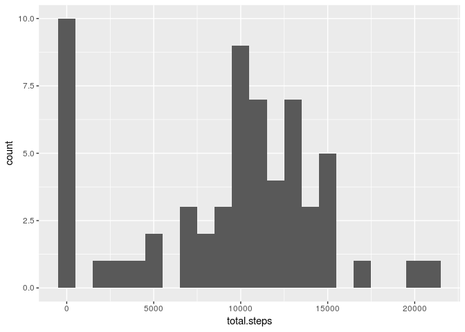
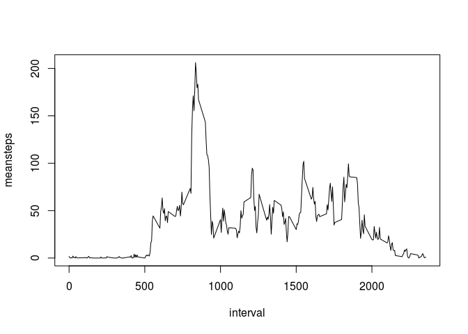
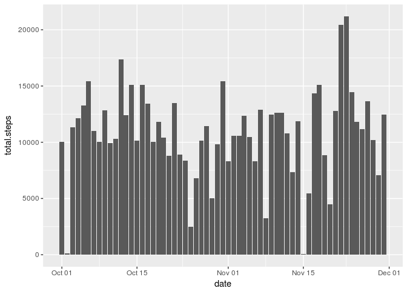
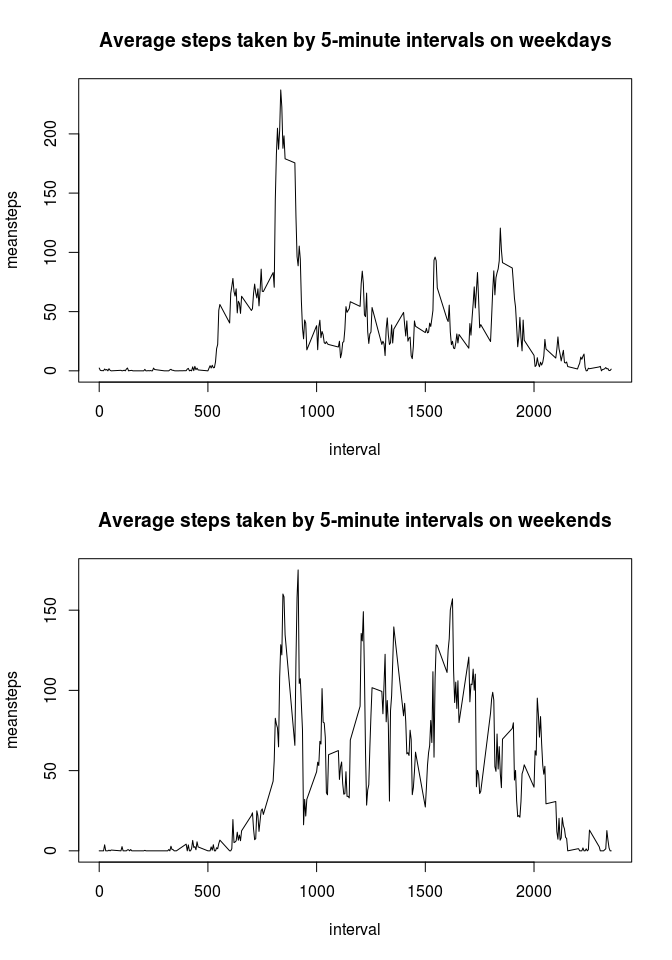

## Loading and preprocessing the data


```r
# 1
unzip('activity.zip')
PamData <- read.csv('activity.csv')
# 2
PamData$date <- as.Date(PamData$date, format = "%Y-%m-%d")
```

## What is mean total number of steps taken per day?

```r
# 1
stepsPerDay <- PamData %>% group_by(date) %>% summarise(total.steps = sum(steps, na.rm = T))
# 2
ggplot(stepsPerDay, aes(x = date, y = total.steps)) + geom_histogram(stat = "identity")
```

```
## Warning: Ignoring unknown parameters: binwidth, bins, pad
```

<!-- -->

```r
# 3
sprintf("An average of %d steps were taken each day with a median of %d", as.integer(mean(stepsPerDay$total.steps)), as.integer(median(stepsPerDay$total.steps)))
```

```
## [1] "An average of 9354 steps were taken each day with a median of 10395"
```


## What is the average daily activity pattern?


```r
# 1
meanStepsByInterval <- PamData %>% group_by(interval) %>% summarise(meansteps = mean(steps, na.rm = T))

with(meanStepsByInterval, plot(x = interval, y = meansteps, type = "l"))
```

<!-- -->

```r
# 2
sprintf("The %dth interval has the maximum number of steps on average across all the days in the dataset.", meanStepsByInterval$interval[which.max(meanStepsByInterval$meansteps)])
```

```
## [1] "The 835th interval has the maximum number of steps on average across all the days in the dataset."
```

## Imputing missing values

```r
# 1
sum(is.na(PamData$steps))
```

```
## [1] 2304
```

```r
# 2
# The best strategy I can think of for imputing the missing values is
# using the mean steps of that particular interval in that particular
# weekday, where the NA occurs

# 3
meanStepsByIntByDay <- PamData %>% group_by(weekday = weekdays(date), interval) %>% summarise(meanSteps = mean(steps, na.rm = T))
meanStepsByIntByDay$meanSteps <- ceiling(meanStepsByIntByDay$meanSteps)
naindex <- which(is.na(PamData$steps))
PamData$weekday <- weekdays(PamData$date)
for (i in naindex) {
  PamData[i,1] <- meanStepsByIntByDay[meanStepsByIntByDay$weekday==PamData[i,4] & meanStepsByIntByDay$interval==PamData[i,3],3]
}
# 4
stepsPerDayWoNa <- PamData %>% group_by(date) %>% summarise(total.steps = sum(steps, na.rm = T))

ggplot(stepsPerDayWoNa, aes(x = date, y = total.steps)) + geom_histogram(stat = "identity")
```

```
## Warning: Ignoring unknown parameters: binwidth, bins, pad
```

<!-- -->

```r
sprintf("An average of %d steps were taken each day with a median of %d", as.integer(mean(stepsPerDayWoNa$total.steps)), as.integer(median(stepsPerDayWoNa$total.steps)))
```

```
## [1] "An average of 10832 steps were taken each day with a median of 11015"
```
## Are there differences in activity patterns between weekdays and weekends?


```r
# 1
PamData <- PamData %>% mutate(partOfWeek=weekday %in% c("Saturday", "Sunday"))
PamData$partOfWeek <- factor(PamData$partOfWeek, levels = c(FALSE, TRUE), labels = c("Weekday", "Weekend"))
# 2
avgStepsWdays <- subset(PamData, partOfWeek=="Weekday") %>% group_by(interval) %>% summarise(meansteps=mean(steps))
avgStepsWends <- subset(PamData, partOfWeek=="Weekend") %>% group_by(interval) %>% summarise(meansteps=mean(steps))
par(mfrow = c(2, 1))
with(avgStepsWdays, plot(x = interval, y = meansteps, type = "l",main = "Average steps taken by 5-minute intervals on weekdays"))
with(avgStepsWends, plot(x = interval, y = meansteps, type = "l",main = "Average steps taken by 5-minute intervals on weekends"))
```

<!-- -->
